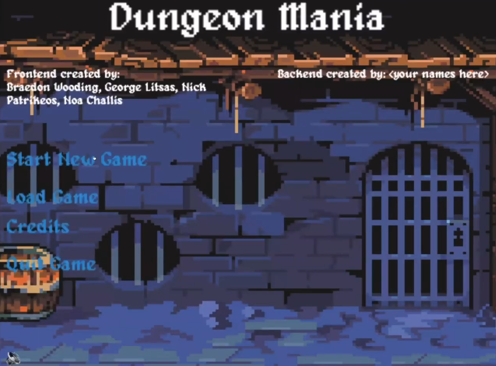
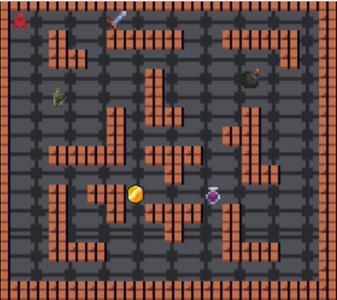

# Dungeonmania

Dungeonmania is a 2D top-down action game where the player must traverse through a series of different dungeons. Each dungeon had its own puzzles, such as maze traversal, enemy combat, floor switch puzzles and more.

For the assignment, while my partner and I were given the assets and initial file setup, it was up to us to code the game. This included making the player’s movement, enemies, doors, keys, portals, boulders and more. All the code written in the dungeonmania folder was written by me and my partner.

Although the project is deprecated, I believe the code within it still demonstrates my proficiency in following important Object-Orientated Programming principles.

